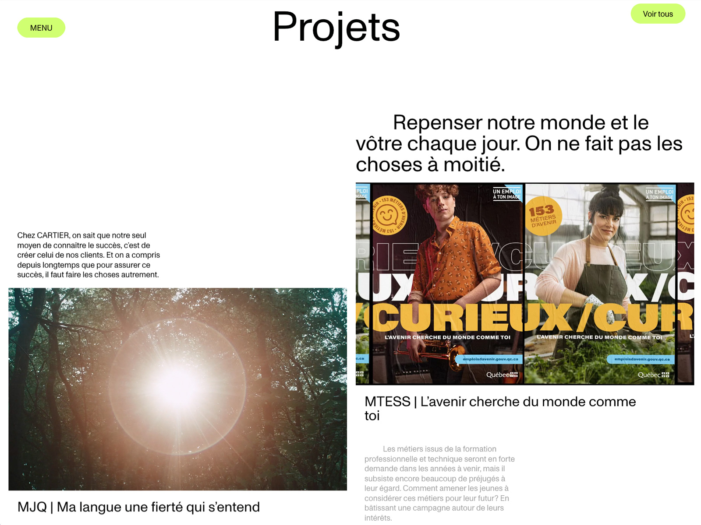

# 🎨 Menu Re-Creation – Inspired by Agence Cartier (Awwwards)

A creative frontend experiment where I re-created a beautiful interactive menu animation originally featured on [Awwwards](https://www.awwwards.com/sites/agence-cartier) by Agence Cartier.

This was part of my 2023 personal archive of creative explorations — a place to sharpen design engineering skills, practice animation techniques, and reverse-engineer inspiring interfaces.

---

## ✨ What’s Inside

- 🎬 Smooth menu animation & transitions
- 💡 Inspired by real-world creative agency work
- ⚙️ Built with [your tech stack here – e.g., Flutter, SvelteKit, Framer Motion, etc.]

